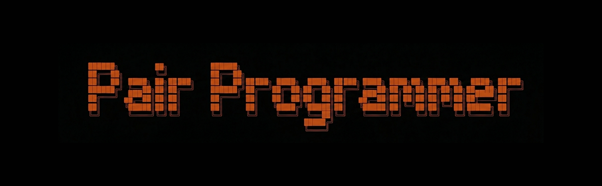

<!-- PROJECT SHIELDS -->
[![Stargazers][stars-shield]][stars-url]
[![Issues][issues-shield]][issues-url]
[![Website][website-shield]][website-url]

<p align="center">
  
</p>

<p align="center">
  Your AI coding assistant that sees your screen and hears your voice — live.
  <br />
  No more copy-pasting errors, repeating yourself, or explaining what just happened.
  <br />
  <br />
  Works with Claude Code, Cursor, Codex, and other skill-compatible agents.
</p>

<p align="center">
  <a href="https://docs.videodb.io"><strong>Explore the docs</strong></a>
  ·
  <a href="https://github.com/video-db/pair-programmer/issues">Report an issue</a>
  ·
  <a href="https://discord.gg/py9P639jGz">Join Discord</a>
</p>

---

## What is Pair Programmer?

Pair Programmer is a **skill** that lets your AI coding assistant see your screen and hear your voice while you work.

It captures:

- **Your screen** — errors, code, browser tabs, terminals, everything you see
- **Your voice** — ideas, questions, debugging thoughts, instructions
- **Your system audio** — YouTube tutorials, meeting calls, demos

Everything gets saved and becomes searchable. So instead of explaining what happened, just ask:

- *What was on screen when the test failed?*
- *What did I say about the database issue?*
- *Summarize the last 10 minutes*

It's like giving your AI eyes and ears.

---

## Demo

https://github.com/user-attachments/assets/65af0b7e-3af9-4d05-9f0a-1415b19b4e9a

---

## Quickstart

### 1. Install

If you have an older version installed, remove it first before upgrading.

```bash
npx skills add video-db/pair-programmer
```

### 2. Setup

Get a free VideoDB API key from [console.videodb.io](https://console.videodb.io) (no credit card required) and set it:

```bash
export VIDEO_DB_API_KEY=your-key
```

Or add it to a `.env` file in your project root.

> **Note:** Commands below (starting with `/`) are run inside your AI coding agent — Claude Code, Cursor, Codex, etc.
> The command prefix may vary by agent. For example, Codex uses `$` instead of `/`.

Then run setup inside your agent:

```
/pair-programmer setup
```

### 3. Use

**🟢 Go Live** — start capturing your screen, mic, and system audio:

```
/pair-programmer record
```

A window will pop up so you can choose what to capture. Once started, a small overlay shows you're live.

**🔍 Search** — ask questions about what happened:

```
/pair-programmer search "what was I working on when I mentioned the auth bug?"
```

```
/pair-programmer search "what did I say in the last 5 minutes?"
```

**🎤 Act** — said something you want done? Let your AI act on it:

```
/pair-programmer act
```

**📋 Summary** — get a quick recap:

```
/pair-programmer what-happened
```

**⏹️ Stop** — stop when you're done:

```
/pair-programmer stop
```

---

## Why use this?

Ever had to explain the same thing twice to your AI? Or copy-paste an error message it could have just seen? Pair Programmer fixes that.

**Watch a YouTube tutorial together** — your AI follows along without you explaining anything.

**Brainstorm out loud** — just talk through your ideas. Your AI hears and remembers everything.

**Debug without repeating yourself** — it already saw the error on your screen.

**Get context from meetings** — had a call about requirements? Your AI was listening.

Use it for:

- Debugging sessions
- Following along with tutorials
- Voice-first coding
- Meeting follow-ups
- Bug reproduction
- Architecture walkthroughs

---

## Commands

> The `/` prefix shown below is for Claude Code. Other agents may use a different prefix (e.g. `$` for Codex).

| Command | What it does |
|---------|--------------|
| `/pair-programmer record` | Go live — start capturing screen, mic, and audio |
| `/pair-programmer stop` | Stop capturing |
| `/pair-programmer search "<query>"` | Search what happened using plain English |
| `/pair-programmer act` | Act on something you said out loud |
| `/pair-programmer what-happened` | Get a summary of recent activity |
| `/pair-programmer setup` | Install dependencies and set things up |
| `/pair-programmer config` | Change settings |

---

## Requirements

- **Node.js 18+**
- **macOS 12+ or Windows**
- **VideoDB API key** — free at [console.videodb.io](https://console.videodb.io)

---

## Alternative installation

You can also install via the Claude Code plugin marketplace:

```
/plugin marketplace add video-db/pair-programmer
/plugin install pair-programmer@videodb
```

---

## Community and support

Pair Programmer is open source. Use it, modify it, make it your own.

- **Issues:** [GitHub Issues](https://github.com/video-db/pair-programmer/issues)
- **Docs:** [docs.videodb.io](https://docs.videodb.io)
- **Discord:** [Join the community](https://discord.gg/py9P639jGz)

---

<p align="center">Made with ❤️ by the <a href="https://videodb.io">VideoDB</a> team</p>

<!-- MARKDOWN LINKS & IMAGES -->
[stars-shield]: https://img.shields.io/github/stars/video-db/pair-programmer.svg?style=for-the-badge
[stars-url]: https://github.com/video-db/pair-programmer/stargazers
[issues-shield]: https://img.shields.io/github/issues/video-db/pair-programmer.svg?style=for-the-badge
[issues-url]: https://github.com/video-db/pair-programmer/issues
[website-shield]: https://img.shields.io/website?url=https%3A%2F%2Fvideodb.io%2F&style=for-the-badge&label=videodb.io
[website-url]: https://videodb.io/
